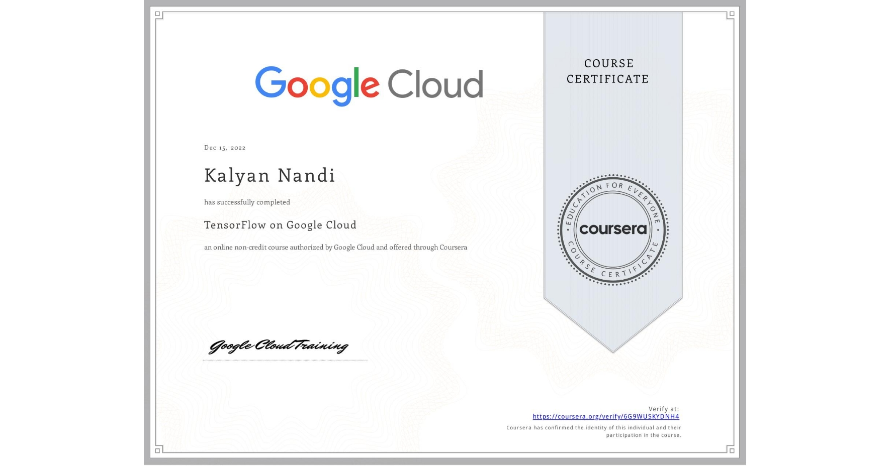

# Lab Solutions on Machine Learning in the Enterprise - Google Cloud

Access the courses in the Coursera [TensorFlow on Google Cloud](https://in.coursera.org/learn/intro-tensorflow/home/week/1) Offered by `Google Cloud`.

<!-- {width=50%} -->

The solutions here are **ONLY FOR REFERENCE** to guide you if you get stuck somewhere. 